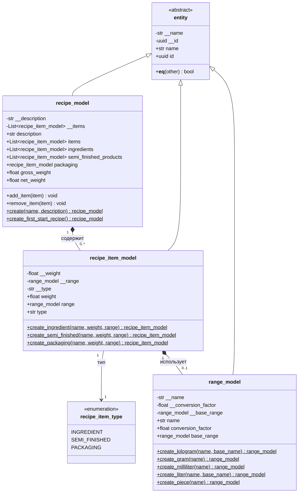

# UML диаграмма моделей рецептов (технологических карт)

## Диаграмма классов

```mermaid
classDiagram
    class entity {
        <<abstract>>
        -str __name
        -uuid __id
        +str name
        +uuid id
        +__eq__(other) bool
    }

    class recipe_model {
        -str __description
        -List~recipe_item_model~ __items
        +str description
        +List~recipe_item_model~ items
        +List~recipe_item_model~ ingredients
        +List~recipe_item_model~ semi_finished_products
        +recipe_item_model packaging
        +add_item(item) void
        +remove_item(item) void
        +float gross_weight
        +float net_weight
        +create(name, description)$ recipe_model
        +create_first_start_recipe()$ recipe_model
    }

    class recipe_item_model {
        -float __weight
        -range_model __range
        -str __type
        +float weight
        +range_model range
        +str type
        +create_ingredient(name, weight, range)$ recipe_item_model
        +create_semi_finished(name, weight, range)$ recipe_item_model
        +create_packaging(name, weight, range)$ recipe_item_model
    }

    class recipe_item_type {
        <<enumeration>>
        INGREDIENT
        SEMI_FINISHED
        PACKAGING
    }

    class range_model {
        -str __name
        -float __conversion_factor
        -range_model __base_range
        +str name
        +float conversion_factor
        +range_model base_range
        +create_kilogram(name, base_name)$ range_model
        +create_gram(name)$ range_model
        +create_milliliter(name)$ range_model
        +create_liter(name, base_name)$ range_model
        +create_piece(name)$ range_model
    }

    entity <|-- recipe_model
    entity <|-- recipe_item_model
    entity <|-- range_model

    recipe_model "1" *-- "0..*" recipe_item_model : содержит
    recipe_item_model "1" --> "1" recipe_item_type : тип
    recipe_item_model "1" *-- "0..1" range_model : использует
```

