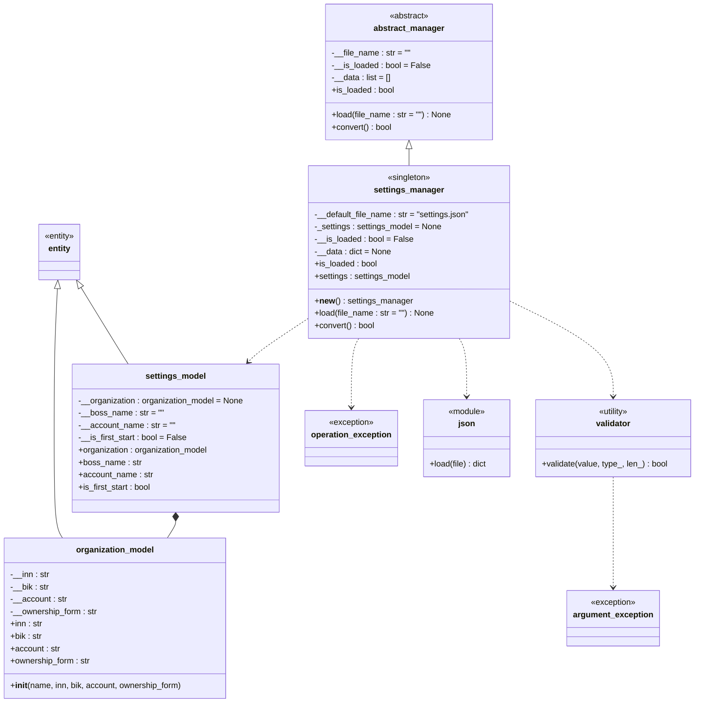

# диаграмма settings_manager

```mermaid 
classDiagram
    class abstract_manager {
        <<abstract>>
        -__file_name : str = ""
        -__is_loaded : bool = False
        -__data : list = []
        +load(file_name : str = "") None
        +convert() bool
        +is_loaded : bool
    }

    class settings_manager {
        <<singleton>>
        -__default_file_name : str = "settings.json"
        -_settings : settings_model = None
        -__is_loaded : bool = False
        -__data : dict = None
        +__new__() settings_manager
        +load(file_name : str = "") None
        +convert() bool
        +is_loaded : bool
        +settings : settings_model
    }

    class settings_model {
        -__organization : organization_model = None
        -__boss_name : str = ""
        -__account_name : str = ""
        -__is_first_start : bool = False
        +organization : organization_model
        +boss_name : str
        +account_name : str
        +is_first_start : bool
    }

    class organization_model {
        -__inn : str
        -__bik : str
        -__account : str
        -__ownership_form : str
        +__init__(name, inn, bik, account, ownership_form)
        +inn : str
        +bik : str
        +account : str
        +ownership_form : str
    }

    class entity {
        <<entity>>
    }

    class validator {
        <<utility>>
        +validate(value, type_, len_) bool
    }

    class operation_exception {
        <<exception>>
    }

    class argument_exception {
        <<exception>>
    }

    class json {
        <<module>>
        +load(file) dict
    }

    abstract_manager <|-- settings_manager 
    entity <|-- settings_model 
    entity <|-- organization_model 

    settings_manager ..> settings_model 
    settings_model *-- organization_model 
    settings_manager ..> validator 
    settings_manager ..> json 
    settings_manager ..> operation_exception
    validator ..> argument_exception
```