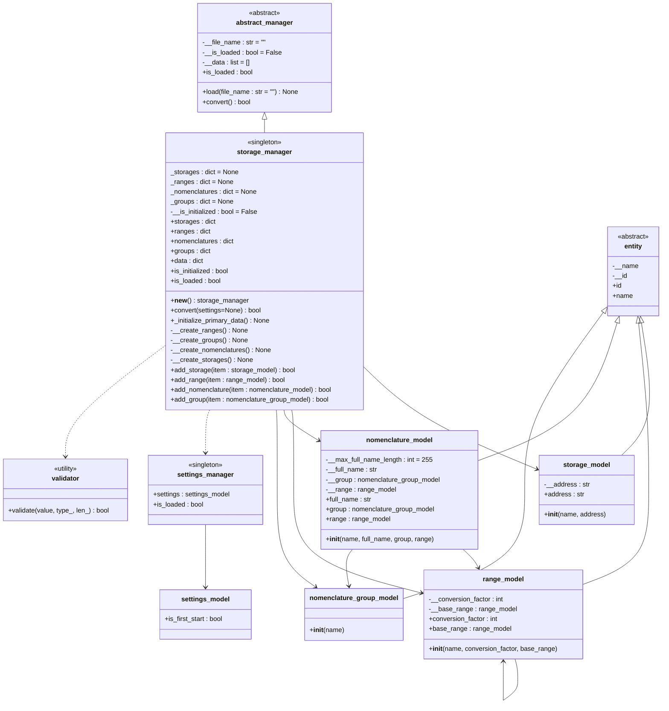

# диаграмма storage_manager

```mermaid 
classDiagram
    class abstract_manager {
        <<abstract>>
        -__file_name : str = ""
        -__is_loaded : bool = False
        -__data : list = []
        +load(file_name : str = "") None
        +convert() bool
        +is_loaded : bool
    }

    class storage_manager {
        <<singleton>>
        _storages : dict = None
        _ranges : dict = None
        _nomenclatures : dict = None
        _groups : dict = None
        -__is_initialized : bool = False
        +__new__() storage_manager
        +convert(settings=None) bool
        +_initialize_primary_data() None
        -__create_ranges() None
        -__create_groups() None
        -__create_nomenclatures() None
        -__create_storages() None
        +add_storage(item : storage_model) bool
        +add_range(item : range_model) bool
        +add_nomenclature(item : nomenclature_model) bool
        +add_group(item : nomenclature_group_model) bool
        +storages : dict
        +ranges : dict
        +nomenclatures : dict
        +groups : dict
        +data : dict
        +is_initialized : bool
        +is_loaded : bool
    }

    class storage_model {
        -__address : str
        +__init__(name, address)
        +address : str
    }

    class range_model {
        -__conversion_factor : int
        -__base_range : range_model
        +__init__(name, conversion_factor, base_range)
        +conversion_factor : int
        +base_range : range_model
    }

    class nomenclature_model {
        -__max_full_name_length : int = 255
        -__full_name : str
        -__group : nomenclature_group_model
        -__range : range_model
        +__init__(name, full_name, group, range)
        +full_name : str
        +group : nomenclature_group_model
        +range : range_model
    }

    class nomenclature_group_model {
        +__init__(name)
    }

    class entity {
        <<abstract>>
        -__name
        -__id
        +id
        +name
    }

    class settings_manager {
        <<singleton>>
        +settings : settings_model
        +is_loaded : bool
    }

    class settings_model {
        +is_first_start : bool
    }

    class validator {
        <<utility>>
        +validate(value, type_, len_) bool
    }

    abstract_manager <|-- storage_manager 
    entity <|-- storage_model
    entity <|-- range_model
    entity <|-- nomenclature_model
    entity <|-- nomenclature_group_model

    storage_manager --> storage_model
    storage_manager --> range_model 
    storage_manager --> nomenclature_model
    storage_manager --> nomenclature_group_model 
    storage_manager ..> settings_manager 
    settings_manager --> settings_model
    storage_manager ..> validator 

    range_model --> range_model 
    
    nomenclature_model --> range_model
    nomenclature_model --> nomenclature_group_model 
```
